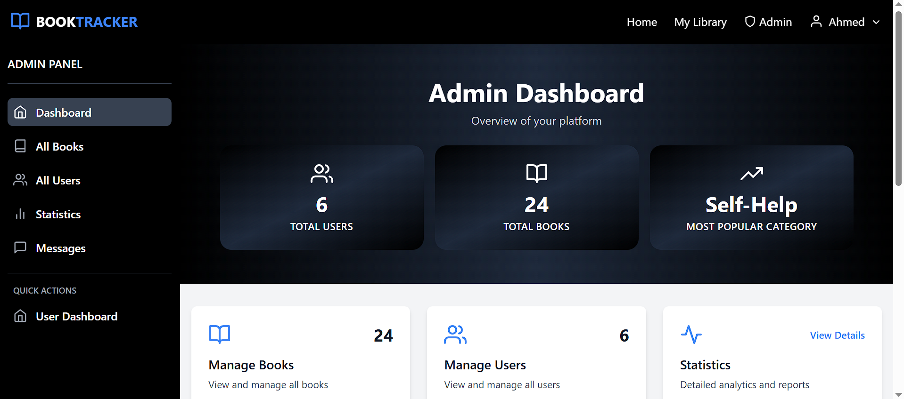
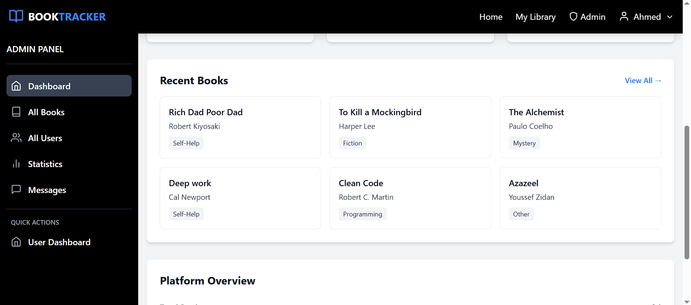
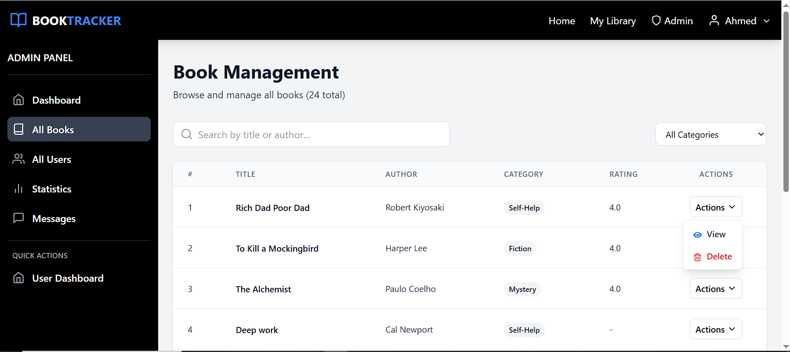
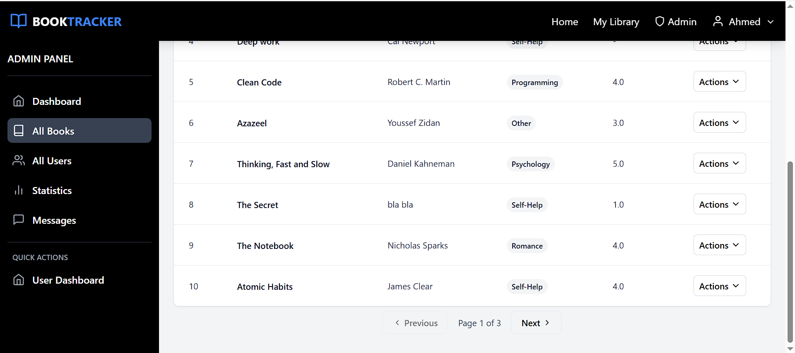
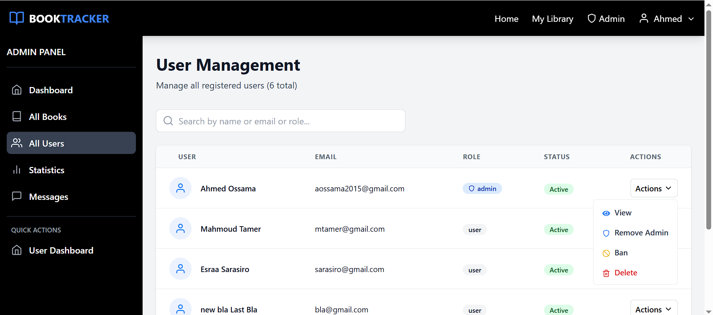
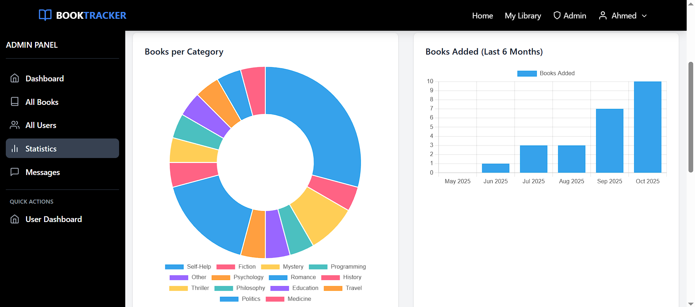
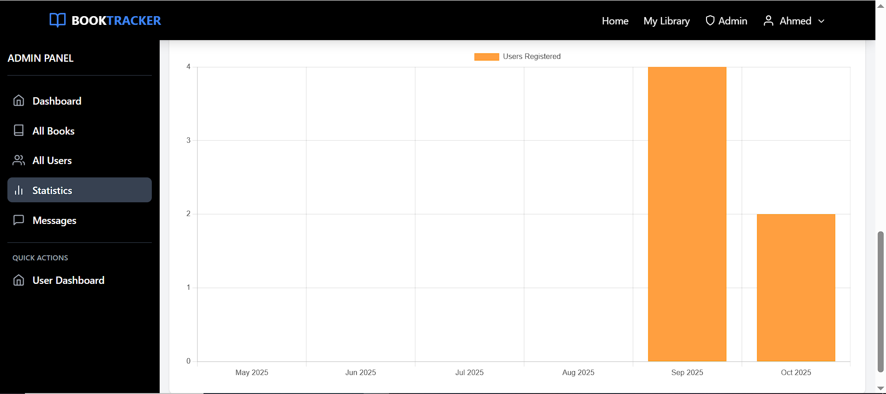
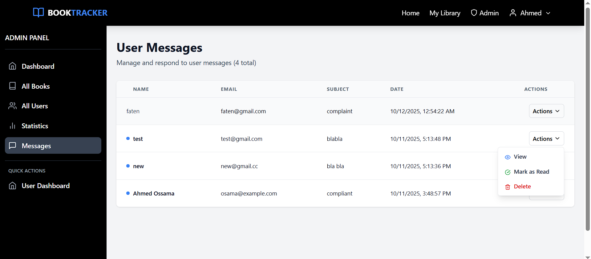

# 📚 Book Tracker

A full-stack **MERN** application that allows users to manage and track books.  
It includes features like user authentication, book categorization, and visual dashboards with charts for user and book activity over the last 6 months.  
Users can also send messages or feedback through the **Contact Us** page.  
All submissions are securely stored in the database and accessible only to the admin via the dashboard.

---

## 🧰 Tech Stack
- **Frontend:** React.js, Tailwind CSS, Chart.js  
- **Backend:** Node.js, Express.js, MongoDB  
- **Hosting:** Vercel (Frontend) & Railway (Backend)

---

## ✨ Features
- 👤 User signup, login, and authentication  
- 📚 Add, edit, delete, and list books  
- 📝 Edit user data (change password & profile picture)  
- 📊 Dashboard to manage users, books, and messages  
- 📈 Dynamic charts for monthly statistics  
- 💻 Responsive design for all devices  

---

## 👥 User Access
Users can:
- Sign up and log in  
- Browse and manage their own books  
- Edit and update their profile  
- Send feedback or messages through the Contact Us page  

---

## 🧑‍💼 Admin Access
The **Admin Dashboard** is restricted to authorized users only.  

Admins can manage and view:
- Registered users  
- Uploaded books  
- Book & user statistics  
- Feedback/messages from users  

🔒 For privacy and security, **admin routes are not publicly accessible**.  
Please check the screenshots below to see the admin features.

---

## 📸 Screenshots (Admin Dashboard)

### Dashboard Overview

### Books Management

### Users Management

### Statistics

### Messages

